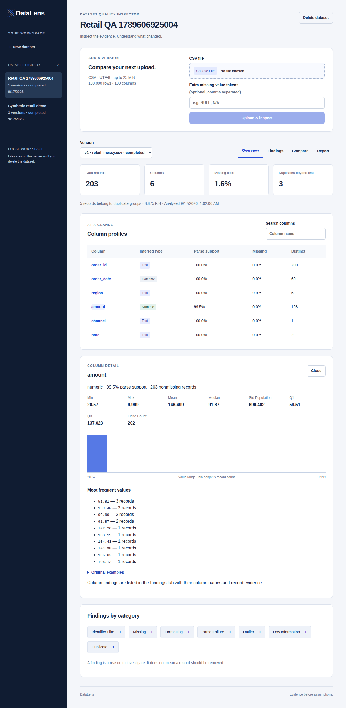
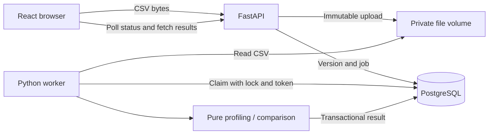

# DataLens

A local dataset quality inspector: upload CSV files, inspect explainable findings, compare versions, and export reports. Built with React/TypeScript, FastAPI, PostgreSQL, and a separate Python worker.

No source data is automatically repaired. There is no universal quality score. Every finding includes a rule, denominator, evidence, limitations, and a next step.

## Cost

No paid APIs, hosting, cloud databases, or purchased services are required. All processing runs locally. Docker Desktop is free for personal/educational use under its terms. Public application hosting is not configured.

## Run locally

Install and start [Docker Desktop for Mac](https://docs.docker.com/desktop/setup/install/mac-install/). Choose the installer matching your computer.

From the project folder:

```sh
docker compose up --build -d
```

Open **http://localhost:5173**. API documentation: **http://localhost:8000/docs**. Ports bind to localhost only. Docker builds the frontend, installs the Python dependencies, starts PostgreSQL, runs migrations, and starts the API and worker. You do not need to install Node or Python separately for this path.

To inspect or stop:

```sh
docker compose ps
docker compose logs --tail=80 api worker
docker compose down
```

Stopping preserves data. To erase all project database and upload volumes, deliberately run `docker compose down -v`. That reset is destructive. Delete individual datasets through the interface instead when you want to retain other data.

## Try the supplied data

1. Create “Retail orders” and upload `sample_data/retail_messy.csv`.
2. Wait for the column summary. It should contain 203 rows and six columns.
3. Open Findings: inspect the invalid amount, formatting variants, missing regions, and duplicate evidence.
4. Upload `sample_data/retail_next.csv` under the same dataset.
5. Open Compare, select the two completed versions, and compare them.
6. Open Report to download JSON or print/save PDF. Raw examples are excluded by default.

The sample data is deterministic and synthetic. `python sample_data/generate.py` regenerates it. See [fixture details](sample_data/README.md).

## Screenshots



[Version comparison](docs/screenshots/comparison.png) · [Mobile report](docs/screenshots/mobile-report.png)

## What works

- Streaming upload byte limits and strict bounded CSV validation.
- Column type inference and descriptive statistics, with raw values preserved.
- Six quality categories: missingness, duplicates, type/parse inconsistencies, potential outliers, formatting variants, and low-information/identifier-like columns.
- Dataset/version history and asynchronously persisted results.
- Worker row locks, bounded attempts, leases, heartbeat and stale-claim fencing.
- Schema differences, missingness deltas, aligned numeric histograms, descriptive KS statistic, and categorical total variation.
- Paginated findings and dataset library.
- Complete JSON reports and print view, with optional example inclusion.
- Dataset deletion with active-job protection and durable file-cleanup records.

## How it fits together



A dataset is a named collection; a version is one uploaded file; an analysis is its result; a job tracks processing. Statistics use JSON, while identity, relationships and state use relational columns and constraints.

The API validates a file before queueing, so malformed CSV is reported promptly. The worker re-parses the immutable file and writes its entire result in one transaction. It uses PostgreSQL as the queue to keep setup small. Retries may repeat computation; unique result constraints and claim tokens keep persistence safe.

## Where to read the code

| Concern | File |
|---|---|
| Requests, uploads and report routes | `backend/app/main.py` |
| Entities and foreign keys | `backend/app/models.py` |
| Initial schema migration | `backend/migrations/versions/0001_initial.py` |
| CSV validation and six check categories | `backend/app/profiling.py` |
| Version statistics | `backend/app/comparison.py` |
| Job claiming, heartbeat, recovery and writes | `backend/app/worker.py` |
| Database and storage settings | `backend/app/db.py` |
| Frontend flow and views | `frontend/src/main.tsx` |
| Responsive and print styling | `frontend/src/style.css` |

Start with the [learning guide](docs/LEARNING_GUIDE.md), then read the [specification and API contract](docs/SPECIFICATION.md). The guide explains each milestone, its tradeoffs, and exercises.

## CSV and statistics contract

UTF-8/BOM, comma-separated, standard quoted fields, one header row. Maximum 25 MiB, 100,000 data rows and 100 columns. Duplicate/empty headers, malformed quoting, inconsistent record widths, NULs and unsupported encodings fail. Header-only files produce zero-row results. Header presence is a declared contract: a parser cannot know whether a plausible first record was intended as data.

Whitespace-only fields are missing. Additional tokens are case-sensitive after outer whitespace trimming. NA is not a default missing token. Exact duplicate rows use unmodified decoded strings. Record numbers start at one after the header and differ from physical line numbers when fields contain newlines.

Type precedence: boolean words, finite numbers, ISO dates, text. Dominant threshold 95%. Leading-zero numeric strings are protected as text. Non-finite numeric strings count as parse failures when a numeric type is dominant. A text parse support of 100% is representability, not a claim about intended semantic type.

Numeric standard deviation is population SD (`ddof=0`). Quartiles use NumPy's default linear interpolation. IQR checks skip fewer than four finite values or zero IQR. Extreme arithmetic that cannot be represented as finite JSON becomes null; histogram calculation can be omitted with a warning.

Near-constant threshold 95%; identifier-like threshold 98% distinct with at least 20 nonmissing records. Missingness warning/high thresholds are 10%/50%. These are versioned project defaults. Change advanced thresholds through `Config` in Python; the upload UI exposes only additional missing tokens in this release.

Comparison excludes missing values from distributions. Columns match by exact name; no rename guessing or row matching. A categorical Other bucket is encoded as null, separate from a real category literally named “Other.” See [statistical learning notes](docs/LEARNING_GUIDE.md).

## Developer workflow

Optional: install Python 3.12, Node 22 and pnpm 11.19.0 to develop outside containers. Keep only the database container running when using local API/frontend processes on the same ports.

```sh
docker compose up -d db
python3.12 -m venv .venv
. .venv/bin/activate
pip install -r backend/requirements.lock
cd backend
alembic upgrade head
uvicorn app.main:app --host 127.0.0.1 --port 8000 --reload --no-access-log
```

In another terminal, activate the environment, enter `backend/`, then run `python -m app.worker`. Both processes must use the same `DATABASE_URL` and `STORAGE_DIR`; defaults match the local database container. `.env.example` documents settings but is not automatically loaded by Python; export overrides explicitly.

In a third terminal:

```sh
cd frontend
pnpm install --frozen-lockfile
pnpm dev
```

The dev frontend proxies `/api` to the local FastAPI server. Docker serves the production frontend through nginx. This avoids broad cross-origin permissions.

## Tests

Engine tests (inside Docker):

```sh
docker compose run --rm api python -m pytest tests/test_engine.py -q
```

Integration tests **drop and recreate tables**. Use only a disposable test database:

```sh
docker compose exec db createdb -U datalens datalens_test
docker compose run --rm -e TEST_DATABASE_URL=postgresql+psycopg://datalens:local-development-only@db:5432/datalens_test api python -m pytest tests -q
```

The test database creation command is needed once. Never point `TEST_DATABASE_URL` at your application database. Integration tests require PostgreSQL and are skipped when the variable is absent.

With the complete app running at localhost:5173, Google Chrome installed, and frontend dependencies installed:

```sh
cd frontend
pnpm build
pnpm test:e2e
```

The browser test creates a uniquely named synthetic dataset, uploads two versions, inspects findings, compares, downloads and parses the report, checks mobile overflow, and deletes its own dataset.

See [verification results](docs/VERIFICATION.md) and [benchmark conditions](docs/BENCHMARKS.md). Performance numbers are measurements of one workload, not guaranteed service capacity.

## Limits and next steps

- Local, single-user setup. No authentication, user isolation, quotas or public hosting. Do not expose these ports publicly. Public deployment requires a separate explicit decision and hardening work.
- Whole-file profiling stays in memory after bounded parsing. Five-column benchmarks do not prove capacity for every 100-column input.
- Statistical rules cannot infer domain validity or fitness for a model. They do not estimate accuracy or causal effects.
- The UI exposes missing tokens; advanced thresholds are Python configuration.
- Dataset deletion is unavailable while jobs are queued/running. Start the worker to let pending jobs finish or exhaust retries.
- A hard process kill between file creation and metadata commit can leave an orphan file. Normal validation failures are cleaned immediately; a future reconciliation job should handle crash-orphan uploads.
- No scheduled retention: files remain until explicit deletion.
- All dependency versions resolve through the Python lockfile and pnpm lockfile. Base Docker images use major/minor tags rather than immutable digests.
- Reports that omit examples still contain names, metadata and aggregate statistics. They are not automatically anonymized.

A good next improvement is a dataset schema contract: let a user explicitly declare that a field is required, an identifier, or numeric. That adds domain knowledge without pretending inference is certainty.

For a demonstration and honest resume wording, see [demo and interview notes](docs/DEMO_AND_RESUME.md).

### Browser test with Docker only

If Node/Chrome are not installed or the desktop environment restricts browser automation, use the optional test container:

```sh
docker compose --profile test build e2e
docker compose --profile test run --rm e2e
```

The first build downloads the Playwright browser image. It runs against the real frontend/API/worker/database on the Compose network. Keep the app running before starting the test. This path needs only Docker Desktop.
